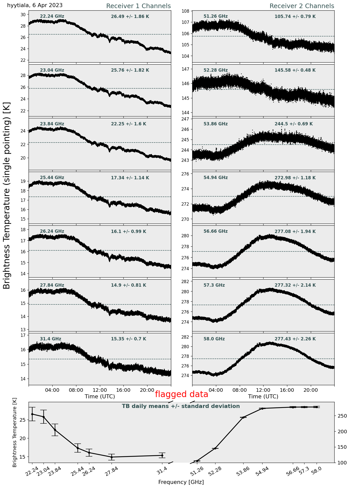
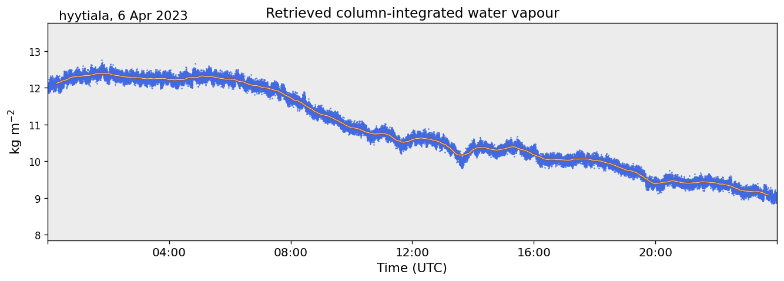
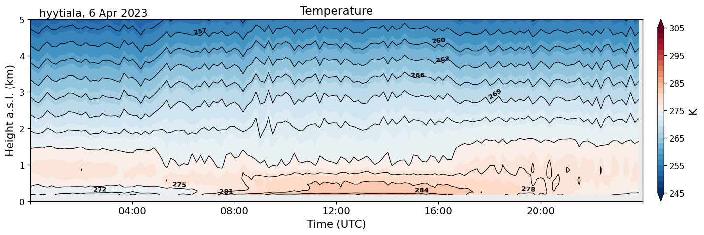

================
MWRpy processing
================

In this tutorial `MWRpy <https://github.com/actris-cloudnet/mwrpy/>`_ products are generated from raw data, including
quality control and visualization. This example utilizes files taken from the ACTRIS site
`Hyytiala <https://cloudnet.fmi.fi/site/hyytiala>`_:

- RPG-HATPRO microwave radiometer:
    - Brightness temperatures: `230406.BRT <https://github.com/actris-cloudnet/mwrpy/blob/main/tests/data/hyytiala/230406.BRT>`_
    - Housekeeping data: `230406.HKD <https://github.com/actris-cloudnet/mwrpy/blob/main/tests/data/hyytiala/230406.HKD>`_
    - Elevation scans: `230406.BLB <https://github.com/actris-cloudnet/mwrpy/blob/main/tests/data/hyytiala/230406.BLB>`_
    - Weather station: `230406.MET <https://github.com/actris-cloudnet/mwrpy/blob/main/tests/data/hyytiala/230406.MET>`_
    - Infrared radiometer: `230406.IRT <https://github.com/actris-cloudnet/mwrpy/blob/main/tests/data/hyytiala/230406.IRT>`_

.. note::

    .BRT and .HKD files are mandatory in MWRpy for processing

Level 1c
~~~~~~~~~

First we convert RPG-HATPRO microwave radiometer (MWR) binary files, including brightness temperature (TB) and
housekeeping data (\*.BRT, \*.HKD), into a Level 1c netCDF file. Data from optional elevation scans (\*.BLB, \*.BLS),
weather station (\*.MET) and infrared radiometer (\*.IRT) are combined in this process and the following quality
flags are derived:

- Bit 1: missing_tb
- Bit 2: tb_below_threshold
- Bit 3: tb_above_threshold
- Bit 4: spectral_consistency_above_threshold
- Bit 5: receiver_sanity_failed
- Bit 6: rain_detected
- Bit 7: sun_moon_in_beam

Quality flags are stored as bits and Bit 1-3 include checks for missing brightness temperature values and their valid
range (2.7 - 330 K). The spectral consistency flag (Bit 4) compares measured and retrieved TB. For this flag, it is
expected to have the corresponding RPG retrieval coefficient file (``SPC*.RET``) in
``/mwrpy/site_config/{site}/coefficients/``. Data from HKD files are used to determine the stability of the receiver
components (Bit 5). The sensor from the attached weather station detects rain for quality Bit 6 and the sun and moon
orbits are calculated and compared to the measurement geometry to detect potential interferences (Bit 7). A quality
flag status variable contains information whether the flag is active.

.. code-block:: python

    import os
    from mwrpy.level1.write_lev1_nc import lev1_to_nc

    SITE = "hyytiala"
    PACKAGE_DIR = os.getcwd()
    DATA_DIR = f"{PACKAGE_DIR}/tests/data/{SITE}"

    hatpro_raw = lev1_to_nc(
        "1C01",
        DATA_DIR,
        site=SITE,
        output_file="mwr_1c.nc",
    )

The data format of the generated ``mwr_1c.nc`` file, including metadata information and variable names, is
compliant with the data structure and naming convention developed in the EUMETNET Profiling Programme
`E-PROFILE <https://www.eumetnet.eu/>`_.

Variables such as brightness temperature can be plotted from the newly generated file.

.. code-block:: python

    import os
    from mwrpy.plots.generate_plots import generate_figure
    PACKAGE_DIR = os.getcwd()
    generate_figure('mwr_1c.nc', ['tb'], save_path=f"{PACKAGE_DIR}/")

Level 2 Single Pointing
~~~~~~~~~~~~~~~~~~~~~~~

Based on the Level 1c netCDF file ``mwr_1c.nc``, MWR single pointing data are extracted
and product specific retrieval coefficients (``LWP*.RET``, ``IWV*.RET``, ``TPT*.RET``, ``HPT*.RET``, ``STA*.RET``)
are applied to generate the Level 2 single pointing product:

.. code-block:: python

    from mwrpy.level2.lev2_collocated import generate_lev2_single
    hatpro_prod = generate_lev2_single("hyytiala", "mwr_1c.nc", "mwr-single.nc")

Variables such as integrated water vapor
(`IWV <https://vocabulary.actris.nilu.no/skosmos/actris_vocab/en/page/watervapourtotalcolumncontent>`_)
can be plotted from the newly generated file.

.. code-block:: python

    import os
    from mwrpy.plots.generate_plots import generate_figure
    PACKAGE_DIR = os.getcwd()
    generate_figure('mwr-single.nc', ['iwv'], save_path=f"{PACKAGE_DIR}/")

Level 2 Multiple Pointing
~~~~~~~~~~~~~~~~~~~~~~~~~

Based on the Level 1c file, MWR multiple pointing data (elevation scans) are extracted
and product specific retrieval coefficients (``TPB*.RET``) are applied to generate the Level 2 multiple pointing
product:

.. code-block:: python

    from mwrpy.level2.lev2_collocated import generate_lev2_multi
    hatpro_prod = generate_lev2_multi("hyytiala", "mwr_1c.nc", "mwr-multi.nc")

Variables such as temperature profiles can be plotted from the newly generated file.

.. code-block:: python

    import os
    from mwrpy.plots.generate_plots import generate_figure
    PACKAGE_DIR = os.getcwd()
    generate_figure('mwr-multi.nc', ['temperature'], save_path=f"{PACKAGE_DIR}/")

Command line usage
~~~~~~~~~~~~~~~~~~

After defining the instrument type and site specific configuration files (including input/output data paths) in
``mwrpy/site_config/``, MWRpy can also be run using the command line tool `mwrpy/cli.py`:

.. code-block::

    mwrpy/cli.py [-h] -s SITE [-d YYYY-MM-DD] [--start YYYY-MM-DD]
                           [--stop YYYY-MM-DD] [-p ...] [{process,plot}]

.. list-table:: Arguments
   :widths: 10 20 20 50
   :header-rows: 1

   * - Short
     - Long
     - Default
     - Description
   * - `-h`
     - `--help`
     -
     - Show help and exit.
   * - `-s`
     - `--site`
     -
     - Site to process data from, e.g, `hyytiala`. Required.
   * - `-d`
     - `--date`
     -
     - Single date to be processed. Alternatively, `--start` and `--stop` can be defined.
   * -
     - `--start`
     - `current day - 1`
     - Starting date.
   * -
     - `--stop`
     - `current day`
     - Stopping date.
   * - `-p`
     - `--products`
     - 1C01, single, multi
     - Processed products, e.g, `1C01, 2I02, 2P03, single`, see Data Types below.

.. list-table:: Commands
   :widths: 20 30
   :header-rows: 1

   * - Command
     - Description
   * - `process`
     - Process data and generate plots (default).
   * - `plot`
     - Only generate plots.
   * - `no-plot`
     - Only generate products.

Data Types
~~~~~~~~~~

Level 1

- 1B01: MWR brightness temperatures from .BRT and .BLB/.BLS files + retrieved spectrum
- 1B11: IR brightness temperatures from .IRT files
- 1B21: Weather station data from .MET files
- 1C01: Combined data type with time corresponding to 1B01

Level 2

- 2I01: Liquid water path (LWP)
- 2I02: Integrated water vapor (IWV)
- 2I06: Stability Indices
- 2P01: Temperature profiles from single-pointing observations
- 2P02: Temperature profiles from multiple-pointing observations
- 2P03: Absolute humidity profiles
- 2P04: Relative humidity profiles (derived from 2P01/2P02 + 2P03)
- 2P07: Potential temperature (derived from 2P01/2P02 + 2P03)
- 2P08: Equivalent potential temperature (derived from 2P01/2P02 + 2P03)
- single: Single pointing data product (including 2I01, 2I02, 2I06, 2P01, 2P03, and derived products)
- multi: Multiple pointing data product (including 2P02, and derived products)
