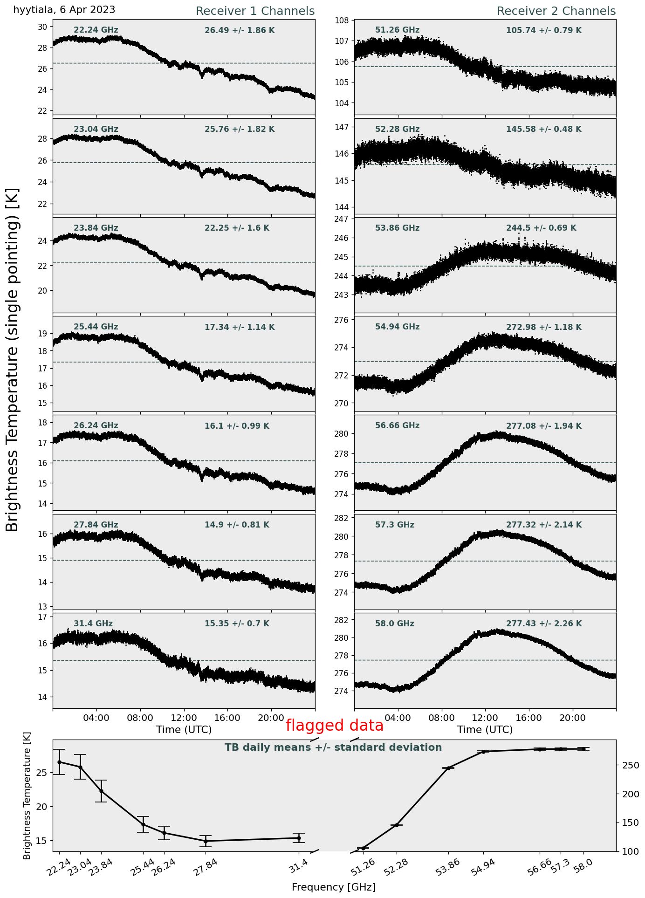
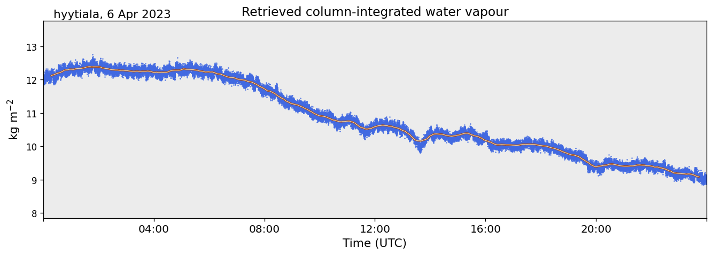
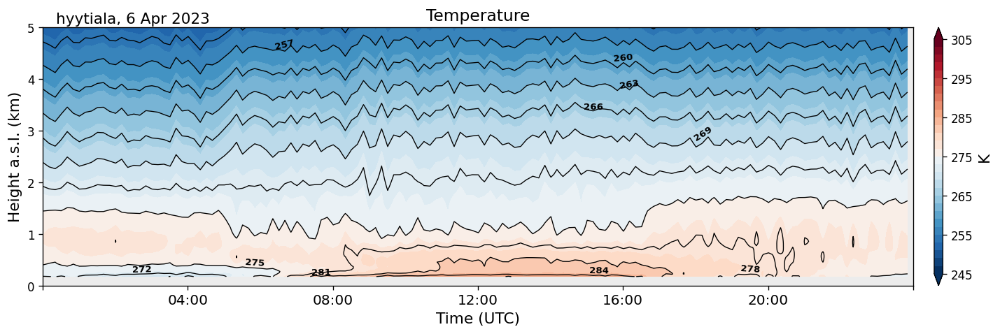

================
MWRpy processing
================

In this tutorial `MWRpy <https://github.com/actris-cloudnet/mwrpy/>`_ products are generated from raw data, including
quality control and visualization. This example utilizes files taken from the ACTRIS site
`Hyytiala <https://cloudnet.fmi.fi/site/hyytiala>`_:

- RPG microwave radiometer:
    - Brightness temperatures: `230406.BRT <https://github.com/actris-cloudnet/mwrpy/blob/main/tests/data/hyytiala/230406.BRT>`_
    - Housekeeping data: `230406.HKD <https://github.com/actris-cloudnet/mwrpy/blob/main/tests/data/hyytiala/230406.HKD>`_
    - Elevation scans: `230406.BLB <https://github.com/actris-cloudnet/mwrpy/blob/main/tests/data/hyytiala/230406.BLB>`_
    - Weather station: `230406.MET <https://github.com/actris-cloudnet/mwrpy/blob/main/tests/data/hyytiala/230406.MET>`_
    - Infrared radiometer: `230406.IRT <https://github.com/actris-cloudnet/mwrpy/blob/main/tests/data/hyytiala/230406.IRT>`_

.. note::

    .BRT and .HKD files are mandatory in MWRpy for processing

First steps for processing examples:

First we define the instrument type configuration file (``mwrpy/site_config/{i_type}.yaml``), including instrument
specific information. An optional site specific configuration file (e.g. ``mwrpy/site_config/{site_name}/config
.yaml``) can be configured, when dealing with multiple instruments of the same type. Then the data path is specified:

.. code-block:: python

    import os

    package_dir = os.getcwd()
    site_name = "hyytiala"
    data_path = f"{package_dir}/tests/data/{site_name}"

E-PROFILE format
----------------

Level 1c
~~~~~~~~~

Now we convert RPG microwave radiometer (MWR) binary files, including brightness temperature (TB) and
housekeeping data (\*.BRT, \*.HKD), into a Level 1c netCDF file. Data from optional elevation scans (\*.BLB, \*.BLS),
weather station (\*.MET) and infrared radiometer (\*.IRT) are combined in this process and the following quality
flags are derived:

- Bit 1: missing_tb
- Bit 2: tb_below_threshold
- Bit 3: tb_above_threshold
- Bit 4: spectral_consistency_above_threshold
- Bit 5: receiver_sanity_failed
- Bit 6: rain_detected
- Bit 7: sun_moon_in_beam

Quality flags are stored as bits and Bit 1-3 include checks for missing brightness temperature values and their valid
range (2.7 - 330 K). The spectral consistency flag (Bit 4) compares measured and retrieved TB. For this flag, it is
expected to have the corresponding RPG retrieval coefficient file (``SPC*.RET``) in
``/mwrpy/site_config/{site_name}/coefficients/``. Data from HKD files are used to determine the stability of the
receiver components (Bit 5). The sensor from the attached weather station detects rain for quality Bit 6 and the sun
and moon orbits are calculated and compared to the measurement geometry to detect potential interferences (Bit 7). A
quality flag status variable contains information whether the flag is active.

.. code-block:: python

    from mwrpy.level1.write_lev1_nc import lev1_to_nc

    mwr_raw = lev1_to_nc(
        data_type="1C01",
        path_to_files=data_path,
        data_format="e-profile",
        site=site_name,
        instrument_type="hatpro",
        output_file=f"{data_path}/mwr_1c.nc",
    )

The data format of the generated ``mwr_1c.nc`` file, including metadata information and variable names, is
compliant with the data structure and naming convention developed in the EUMETNET Profiling Programme
`E-PROFILE <https://www.eumetnet.eu/>`_.

Variables such as brightness temperature can be plotted from the newly generated file.

.. code-block:: python

    from mwrpy.plots.generate_plots import generate_figure

    generate_figure(f"{data_path}/mwr_1c.nc", ['tb'], save_path=f"{data_path}/")

Level 2 Single Pointing
~~~~~~~~~~~~~~~~~~~~~~~

Based on the Level 1c netCDF file ``mwr_1c.nc``, MWR single pointing data are extracted
and product specific retrieval coefficients (``LWP*.RET``, ``IWV*.RET``, ``TPT*.RET``, ``HPT*.RET``, ``STA*.RET``)
are applied to generate the Level 2 single pointing product:

.. code-block:: python

    from mwrpy.level2.lev2_collocated import generate_lev2_single

    mwr_prod = generate_lev2_single(
        site=site_name,
        instrument_type="hatpro",
        data_format="e-profile",
        mwr_l1c_file=f"{data_path}/mwr_1c.nc",
        output_file=f"{data_path}/mwr-single.nc",
    )

Variables such as integrated water vapor
(`IWV <https://vocabulary.actris.nilu.no/skosmos/actris_vocab/en/page/watervapourtotalcolumncontent>`_)
can be plotted from the newly generated file.

.. code-block:: python

    from mwrpy.plots.generate_plots import generate_figure

    generate_figure(f"{data_path}/mwr-single.nc", ['iwv'], save_path=f"{data_path}/")

Level 2 Multiple Pointing
~~~~~~~~~~~~~~~~~~~~~~~~~

Based on the Level 1c file, MWR multiple pointing data (elevation scans) are extracted
and product specific retrieval coefficients (``TPB*.RET``) are applied to generate the Level 2 multiple pointing
product:

.. code-block:: python

    from mwrpy.level2.lev2_collocated import generate_lev2_multi

    mwr_prod = generate_lev2_multi(
        site=site_name,
        instrument_type="hatpro",
        data_format="e-profile",
        mwr_l1c_file=f"{data_path}/mwr_1c.nc",
        output_file=f"{data_path}/mwr-multi.nc",
    )

Variables such as temperature profiles can be plotted from the newly generated file.

.. code-block:: python

    from mwrpy.plots.generate_plots import generate_figure

    generate_figure(f"{data_path}/mwr-multi.nc", ['temperature'], save_path=f"{data_path}/")

Cloudnet format
---------------
In this example the Cloudnet API is used to fetch data and retrieval files and the Cloudnet data format is selected
for processing. More details can be found in the E-PROFILE example above.

Using Cloudnet API to fetch data and retrieval files
~~~~~~~~~~~~~~~~~~~~~~~~~~~~~~~~~~~~~~~~~~~~~~~~~~~~
Download raw data (binary files):

.. code-block:: python

    from cloudnet_api_client import APIClient

    date = "2023-04-06"
    instrument_pid = "https://hdl.handle.net/21.12132/3.f360a2375f3e4e4f" # check https://cloudnet.fmi.fi/instruments to find the PID of your instrument
    client = APIClient()
    instruments = client.instruments()
    i_type = [i.instrument_id for i in instruments if i.pid == instrument_pid][0]
    files = client.raw_files(site_id=site_name, instrument_id=i_type, date=date)
    binary_files = [f for f in files]

    binary_filepaths = await client.adownload(binary_files, data_path)

Download retrieval files:

.. code-block:: python

    import requests

    calibration = client.calibration(instrument_pid, date)
    retrieval = calibration["data"]

    retrieval_files = []
    for file in retrieval["coefficientLinks"]:
        filename = f"{data_path}/{file.split('/')[-1]}"
        response = requests.get(file)
        with open(filename, "wb") as f:
            f.write(response.content)
            retrieval_files.append(str(filename))

Process and plot Level 1 data
~~~~~~~~~~~~~~~~~~~~~~~~~~~~~
In contrast to the E-PROFILE data format, no site specific information file is required, but metadata needs to be
defined. Also, the retrieval files are set as an argument.

.. code-block:: python

    site_info = client.site(site_id=site_name)
    site_meta = {
        "name": site_info.id,
        "altitude": site_info.altitude,
        "latitude": site_info.latitude,
        "longitude": site_info.longitude,
    }

    from mwrpy.level1.write_lev1_nc import lev1_to_nc
    mwr_raw = lev1_to_nc(
        data_type="1C01",
        path_to_files=data_path,
        data_format="cloudnet",
        instrument_type=i_type,
        output_file=f"{data_path}/mwr_1c_cn.nc",
        coeff_files=retrieval_files,
        instrument_config=site_meta,
    )

For plotting, the instrument needs to be defined. In this example, the figure is only displayed and not saved.

.. code-block:: python

    from mwrpy.plots.generate_plots import generate_figure
    fig_name = generate_figure(f"{data_path}/mwr_1c.nc", ['tb'], show=True, instrument_type=i_type)

Process and plot Level 2 data (single & multiple pointing)
~~~~~~~~~~~~~~~~~~~~~~~~~~~~~~~~~~~~~~~~~~~~~~~~~~~~~~~~~~
The site name is set to ``None``, since no site specific information file is needed. Again, no plots are saved, only
displayed.

.. code-block:: python

    from mwrpy.level2.lev2_collocated import generate_lev2_single
    mwr_prod = generate_lev2_single(
        site=None,
        data_format="cloudnet",
        mwr_l1c_file=f"{data_path}/mwr_1c.nc",
        output_file=f"{data_path}/mwr-single.nc",
        coeff_files=retrieval_files,
        instrument_type=i_type,
    )

    from mwrpy.plots.generate_plots import generate_figure
    fig_name = generate_figure(f"{data_path}/mwr-single.nc", ['iwv'], show=True, instrument_type=i_type)

    from mwrpy.level2.lev2_collocated import generate_lev2_multi
    mwr_prod = generate_lev2_multi(
        site=None,
        data_format="cloudnet",
        mwr_l1c_file=f"{data_path}/mwr_1c.nc",
        output_file=f"{data_path}/mwr-multi.nc",
        coeff_files=retrieval_files,
        instrument_type=i_type,
    )

    from mwrpy.plots.generate_plots import generate_figure
    fig_name = generate_figure(f"{data_path}/mwr-multi.nc", ['temperature'], show=True, instrument_type=i_type)
