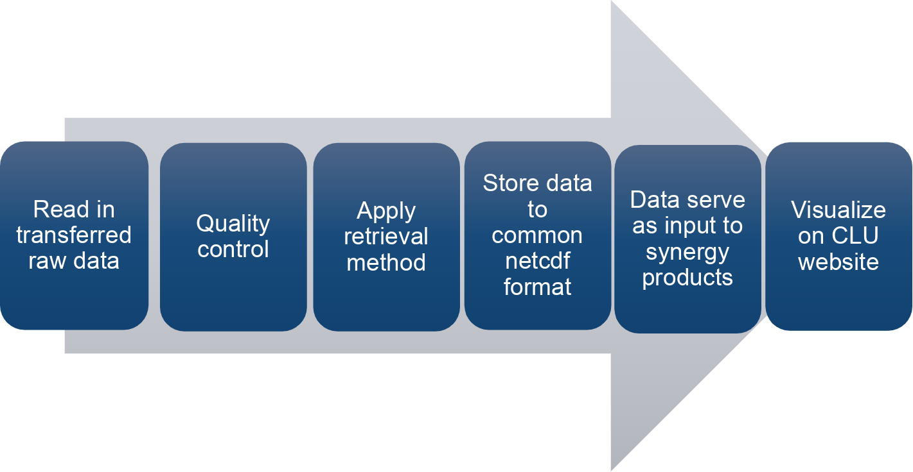

========
Overview
========

Summary
-------

`MWRpy`_ (`Marke 2024`_) is a Python package to process microwave radiometer (MWR) data and was developed in the
framework of `ACTRIS`_ (Aerosol, Clouds and Trace Gases Research Infrastructure, `Laj 2024`_). MWRs are suited to
gain information on the vertical structure of the atmosphere, especially in the lower troposphere, and profiles of
temperature and humidity are retrieved together with integrated quantities of water vapor and the cloud liquid water
path (LWP). The code is an advancement of the IDL based processing software `mwr_pro`_ and is able to handle raw data
from instruments of the manufacturer Radiometer Physics GmbH (RPG, https://www.radiometer-physics.de/). The output
format, including metadata information, variable names, and file naming of is designed to be compliant with the data
structure and naming convention developed together with the EUMETNET Profiling Programme E-PROFILE (`Rüfenacht 2021`_).

One of the key components within the ACTRIS center for cloud remote sensing (CCRES) is the synergistic algorithm
Cloudnet (`Illingworth 2007`_), which classifies hydrometeors in the atmosphere by combining several ground-based remote
sensing instruments, including microwave radiometers. `MWRpy`_ is also embedded in the Python implementation of the
Cloudnet processing scheme (CloudnetPy, `Tukiainen 2020`_), where the output of `MWRpy`_ is harmonized and utilized
together with data streams from other ACTRIS-CCRES instruments, like cloud radar, to derive synergy products. All MWR
files produced by CloudnetPy (also calibration and retrieval information) and corresponding visualizations are stored
at the central cloud remote sensing data center unit (CLU, https://cloudnet.fmi.fi) and accessible through API.

           Flowchart of the `MWRpy`_ processing chain, with the last two steps being exclusive for the CloudnetPy implementation.

Statement of need
-----------------

`MWRpy`_ addresses the needs of a centralized processing, quality control of MWR raw data, and deriving standardized
output of geophysical products. The processing chain contributes to a more consistent data stream within the ACTRIS
network by replacing the mode of operation in Cloudnet of using already processed and non-harmonized MWR data.
Furthermore, generating comparable long-term datasets enables the analysis of trends and differences between all
sites in the network, which is expected to be beneficial not only for atmospheric studies, but also for improving
knowledge on MWR operation and maintenance by additionally monitoring key instrument parameters.

.. _Marke 2024: https://doi.org/10.21105/joss.06733
.. _Laj 2024: https://doi.org/10.1175/BAMS-D-23-0064.1
.. _Tukiainen 2020: https://doi.org/10.21105/joss.02123
.. _Illingworth 2007: https://journals.ametsoc.org/doi/abs/10.1175/BAMS-88-6-883
.. _ACTRIS: http://actris.eu/
.. _MWRpy: https://github.com/actris-cloudnet/mwrpy
.. _mwr_pro: https://zenodo.org/records/7973553
.. _Rüfenacht 2021: https://doi.org/10.1007/s42865-021-00033-w
